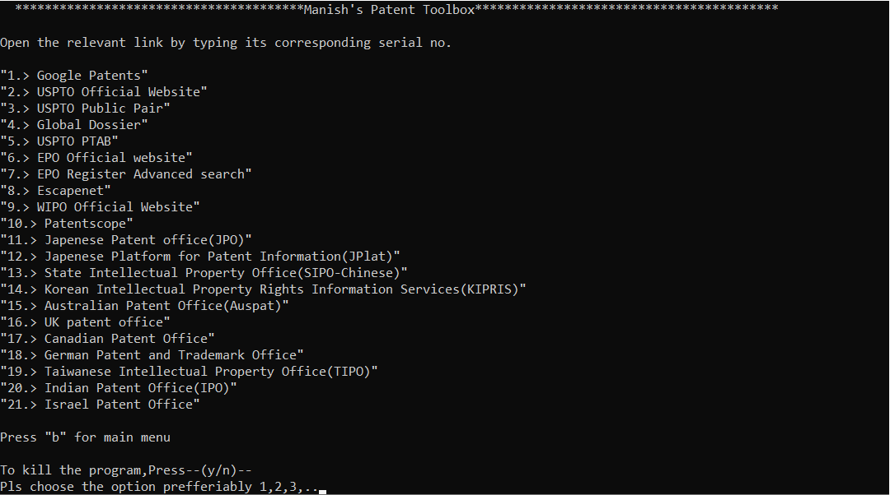

# Project Name
This is small companion program for every person working and researching in IP domain and in particular working for Greyb Pvt Ltd.
<!--Live demo [_here_](https://www.example.com). <!-- If you have the project hosted somewhere, include the link here. -->

## Table of Contents
* [General Info](#general-information)
* [Technologies Used](#technologies-used)
* [Features](#features)
* [Screenshots](#screenshots)
* [Setup](#setup)
* [Usage](#usage)
* [Project Status](#project-status)
* [Room for Improvement](#room-for-improvement)
* [Acknowledgements](#acknowledgements)
* [Contact](#contact)
<!-- * [License](#license) -->

## General Information
- The purpose of the project is to make Switching between diffrent links easily while working in IP domain projects.
- Acess the Company's dashboard,resource planner and diffrent website smoothly with the click of a single button. 
<!-- You don't have to answer all the questions - just the ones relevant to your project. -->

## Technologies Used
- Cmd Batch Scripting

## Features
List the ready features here:
- Provides a single Dashboard for all the relevant links. 
- Easy to navigate to diffrent IP website links.

## Screenshots
!(./images/Dashboard.png)

<!-- If you have screenshots you'd like to share, include them here. -->

<!--## Setup
What are the project requirements/dependencies? Where are they listed? A requirements.txt or a Pipfile.lock file perhaps? Where is it located?

Proceed to describe how to install / setup one's local environment / get started with the project. -->

## Usage
How does one go about using it?
Provide various use cases and code examples here.

`write-your-code-here`

## Project Status
Project is: _in progress_ / _complete_ / _no longer being worked on_. If you are no longer working on it, provide reasons why.

## Room for Improvement
Include areas you believe need improvement / could be improved. Also add TODOs for future development.

Room for improvement:
- Improvement to be done 1
- Improvement to be done 2

To do:
- Feature to be added 1
- Feature to be added 2

## Acknowledgements
Give credit here.
- This project was inspired by...
- This project was based on [this tutorial](https://www.example.com).
- Many thanks to...

## Contact
Created by [@flynerdpl](https://www.flynerd.pl/) - feel free to contact me!

<!-- Optional -->
<!-- ## License -->
<!-- This project is open source and available under the [... License](). -->

<!-- You don't have to include all sections - just the one's relevant to your project -->
